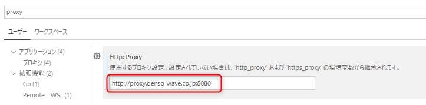

# Go言語学習

## インストール

HPからOSに合わせてGoをインストールする

<https://go.dev/dl/>

## 開発環境

VSCode

### 追加する拡張機能

VSCodeでコマンドパレット(Ctrl+Shift+P)を開いて以下を実行。拡張機能の依存パッケージを全てを選択してインストール。

    GO: Install/Update tools

## コマンド一覧

### バージョン確認

    go version

### プログラムの実行

    go run <ファイル名>

### ビルド

    [GOOS=linux GOARCH=amd64] go build [-o <exe名>] <ファイル名>
    -o:出力する実行ファイルのファイル名。省略した場合は「ファイル名.exe」が出力される
    GOOS=linux GOARCH=amd64:Linux環境を指定してコンパイル
    例) go build -o main.exe main.go

### Go環境変数の出力

    go env

## トラブルシューティング

### package mainを記述すると、エラーが発生する。

    go mod init <package名>
main.goのフォルダで上記コマンドを実行すると、エラーが解消される。

### Go installで失敗する
[現象]
Ctrl+Shift+Pで「Go install」コマンドを実施し、全てのツールをインストールしようとすると、以下のエラーが出力される。

~~~
go: github.com/cweill/gotests/gotests@latest: module github.com/cweill/gotests/gotests: Get "https://proxy.golang.org/github.com/cweill/gotests/gotests/@v/list": dial tcp 142.250.206.241:443: connectex: A connection attempt failed because the connected party did not properly respond after a period of time, or established connection failed because connected host has failed to respond.
~~~

[原因]
VSCodeのプロキシ設定がされていなかった。

[解決策]
Ctrl+,でユーザ設定を開き、Proxy設定に入力する

